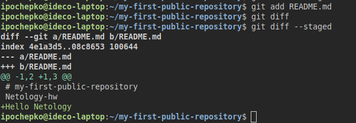

# Домашнее задание к занятию "`GIT`" - `Почепко Илья`

### Инструкция по выполнению домашнего задания

   1. Сделайте `fork` данного репозитория к себе в Github и переименуйте его по названию или номеру занятия, например, https://github.com/имя-вашего-репозитория/git-hw или  https://github.com/имя-вашего-репозитория/7-1-ansible-hw).
   2. Выполните клонирование данного репозитория к себе на ПК с помощью команды `git clone`.
   3. Выполните домашнее задание и заполните у себя локально этот файл README.md:
      - впишите вверху название занятия и вашу фамилию и имя
      - в каждом задании добавьте решение в требуемом виде (текст/код/скриншоты/ссылка)
      - для корректного добавления скриншотов воспользуйтесь [инструкцией "Как вставить скриншот в шаблон с решением](https://github.com/netology-code/sys-pattern-homework/blob/main/screen-instruction.md)
      - при оформлении используйте возможности языка разметки md (коротко об этом можно посмотреть в [инструкции  по MarkDown](https://github.com/netology-code/sys-pattern-homework/blob/main/md-instruction.md))
   4. После завершения работы над домашним заданием сделайте коммит (`git commit -m "comment"`) и отправьте его на Github (`git push origin`);
   5. Для проверки домашнего задания преподавателем в личном кабинете прикрепите и отправьте ссылку на решение в виде md-файла в вашем Github.
   6. Любые вопросы по выполнению заданий спрашивайте в чате учебной группы и/или в разделе “Вопросы по заданию” в личном кабинете.
   
Желаем успехов в выполнении домашнего задания!
   
### Дополнительные материалы, которые могут быть полезны для выполнения задания

1. [Руководство по оформлению Markdown файлов](https://gist.github.com/Jekins/2bf2d0638163f1294637#Code)

---

### Задание 1

1. `Зарегистрируйте аккаунт на GitHub.
Создайте новый отдельный публичный репозиторий. Обязательно поставьте галочку в поле «Initialize this repository with a README».
Склонируйте репозиторий, используя https протокол git clone ....`
   
2. `Перейдите в каталог с клоном репозитория.
Произведите первоначальную настройку Git, указав своё настоящее имя и email: git config --global user.name и git config --global user.email johndoe@example.com.
Выполните команду git status и запомните результат`

3. `Отредактируйте файл README.md любым удобным способом, переведя файл в состояние Modified.
Ещё раз выполните git status и продолжайте проверять вывод этой команды после каждого следующего шага.
Посмотрите изменения в файле README.md, выполнив команды git diff и git diff --staged`

4. `Переведите файл в состояние staged или, как говорят, добавьте файл в коммит, командой git add README.md.
Ещё раз выполните команды git diff и git diff --staged.`

6. `Теперь можно сделать коммит git commit -m 'First commit'.
Сделайте git push origin master.`

7. Ссылка на коммит: https://github.com/ipochepko/my-first-public-repository/commit/7f4dd8acb45708588b3e58a81b212354232ebeb1

### Задание 2

1. `1. Создайте файл .gitignore (обратите внимание на точку в начале файла) и проверьте его статус сразу после создания.
 Добавьте файл .gitignore в следующий коммит `git add...`.
 Напишите правила в этом файле, чтобы игнорировать любые файлы `.pyc`, а также все файлы в директории cache. Сделайте коммит и пуш.`

Ссылка на коммит: https://github.com/ipochepko/my-first-public-repository/commit/cd2a8783c31463f366fa3051ebc5bdebebacf4fd

---

### Задание 3

`Приведите ответ в свободной форме........`

1.  Создайте новую ветку dev и переключитесь на неё.
2. Создайте в ветке dev файл test.sh с произвольным содержимым.
3. Сделайте несколько коммитов и пушей в ветку dev, имитируя активную работу над файлом в процессе разработки.
4. Переключитесь на основную ветку.
5. Добавьте файл main.sh в основной ветке с произвольным содержимым, сделайте комит и пуш . Так имитируется продолжение общекомандной разработки в основной ветке во время разработки отдельного функционала в dev ветке.
6. Сделайте мердж dev ветки в основную с помощью git merge dev. Напишите осмысленное сообщение в появившееся окно комита.
7. Сделайте пуш в основной ветке.
8. Не удаляйте ветку dev.

https://github.com/ipochepko/my-first-public-repository/network

